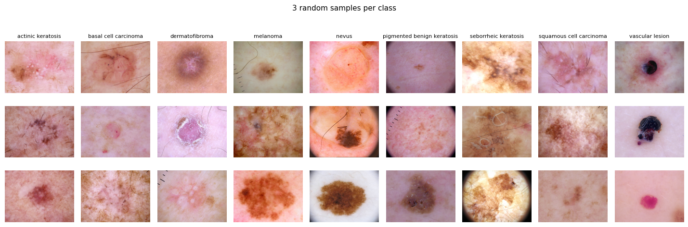
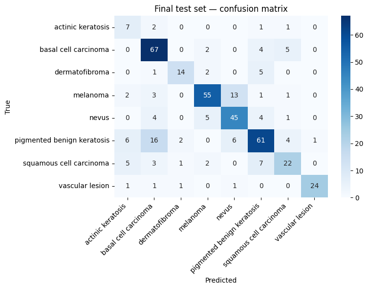
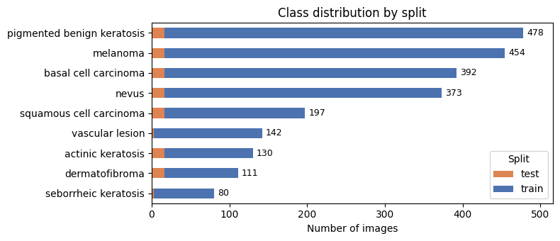
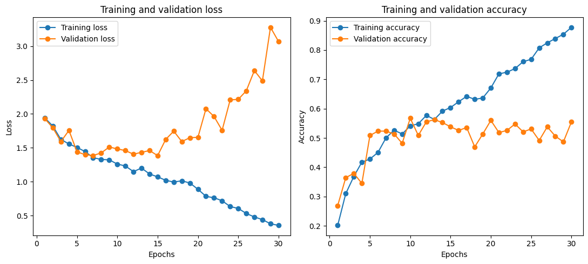
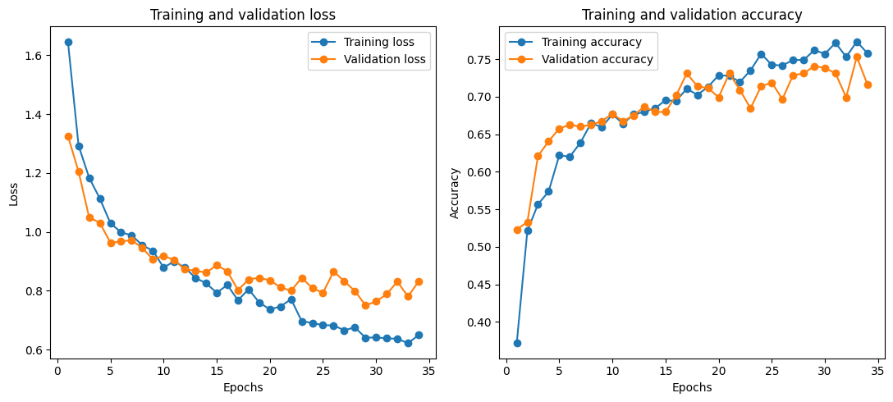

  

<h1 align="center">Skin Lesion Classification</h1>

  Classifying eight types of skin lesion from dermoscopy images with PyTorch. 
  A from-scratch CNN, a regularized CNN, and a frozen ConvNeXt-Tiny transfer model.

  
  
  
  

---

## Results

The frozen ConvNeXt-Tiny model wins. On a held-out test set it reaches **72.13% accuracy** and **0.699 macro F1** across all eight classes.

| Model | Strategy | Test accuracy | Macro F1 |
|---|---|---|---|
| Baseline CNN | from scratch, no regularization | not run on test | 0.403 (val) |
| Regularized CNN | augmentation + dropout + early stopping | not run on test | 0.339 (val) |
| **ConvNeXt-Tiny** | **frozen backbone, transfer learning** | **0.7213** | **0.699** |

Only the winning model touched the test set, and it touched it once. The first two models were judged on validation alone. That keeps the test set honest as a final, unbiased estimate.

  

The best class is vascular lesion at 0.906 F1. The worst is actinic keratosis at 0.438, which is one of the smallest class in the dataset.

---

## The data

The images come from the **ISIC "Skin cancer 9 classes" dataset** on Kaggle ([nodoubttome/skin-cancer9-classesisic](https://www.kaggle.com/datasets/nodoubttome/skin-cancer9-classesisic)). ISIC is the International Skin Imaging Collaboration, a public archive of dermoscopy images used widely in melanoma research.

The download holds 2,357 JPGs across nine labeled classes. I dropped seborrheic keratosis, the smallest class, and built a fresh stratified split on the rest. The modeling set is **2,045 images across 8 classes**:

| Index | Class | | Index | Class |
|---|---|---|---|---|
| 0 | actinic keratosis | | 4 | nevus |
| 1 | basal cell carcinoma | | 5 | pigmented benign keratosis |
| 2 | dermatofibroma | | 6 | squamous cell carcinoma |
| 3 | melanoma | | 7 | vascular lesion |

The classes are imbalanced. That imbalance is the central difficulty of the project, and it is why macro F1 matters more than raw accuracy here.

  

---

## What I wanted to achieve

I set out to answer one question. On a small, imbalanced medical image dataset, how far does a CNN trained from scratch get you, and how much does a pretrained backbone actually help?

So I built three models in sequence. Each one exists to make a point.

The **baseline CNN** is a four-block convolutional network trained from scratch with no augmentation and no dropout. Its job is to establish a floor. It overfits fast.

The **regularized CNN** keeps the exact same backbone and adds the standard defenses: flips, rotation, color jitter, dropout, and early stopping. The overfitting is controlled, but accuracy did not improve much.

The **ConvNeXt-Tiny transfer model** loads an ImageNet-pretrained backbone, freezes it, and trains only a fresh classifier head. The pretrained features do the heavy lifting. Accuracy jumps to 72.13% and every metric improves across the board.

---

## Overfitting, then not

The baseline overfits. Training loss keeps falling while validation loss turns and climbs after the early epochs. The model is memorizing the training set.

  

The transfer model generalizes. Training and validation curves track each other the whole way.

  

---

## Notebooks

Read them in order. Each one hands its output to the next through small files on disk.

**`01_data_inspection.ipynb`** downloads the dataset, walks the folder tree, and turns the file system into a single metadata table with one row per image.

**`02_splits_and_dataset.ipynb`** builds a stratified train/validation/test split, defines the augmentation and evaluation transforms, writes the `SkinLesionDataset` class, and runs a smoke test on one batch to confirm shapes, dtypes, and pixel ranges.

**`03_models.ipynb`** is the heart of the project. It defines the training loop with early stopping, builds and trains all three models, plots the loss and accuracy curves, computes per-class confusion matrices, and runs the final test evaluation on the winning model.

---

## Limitations and next steps

The dataset is small and imbalanced, and the rare classes stay weak because of it. Training on a larger and more balanced set is the most likely way to raise accuracy, especially for actinic keratosis and squamous cell carcinoma.
